# Master Tamil Nadu Agricultural Database Architecture & Documentation

## Executive Summary
This document defines the architectural specification, entity-relationship diagrams (ERD), PostGIS spatial index designs, and integration guidelines for the **Tamil Nadu Master Agricultural Market & Land Intelligence Database**.

---

## 1. Entity-Relationship Diagram (ERD)

```mermaid
erDiagram
    tn_districts ||--o{ tn_markets : "contains"
    tn_markets ||--o{ tn_market_commodities : "lists"
    tn_commodities ||--o{ tn_market_commodities : "mapped_in"
    tn_markets ||--o{ tn_daily_prices : "reports"
    tn_commodities ||--o{ tn_daily_prices : "priced_for"

    tn_districts {
        VARCHAR district_code PK
        VARCHAR district_name_en UK
        VARCHAR district_name_ta UK
        TEXT collector_office_address
        TEXT agriculture_office_address
        TEXT_ARRAY major_crops
        NUMERIC average_rainfall_mm
        TEXT_ARRAY soil_types
        VARCHAR climate_zone
    }

    tn_markets {
        VARCHAR unique_market_id PK
        VARCHAR official_market_code UK
        VARCHAR official_market_name_en
        VARCHAR official_market_name_ta
        VARCHAR common_name
        VARCHAR district_en FK
        VARCHAR district_ta
        VARCHAR taluk
        VARCHAR block
        VARCHAR revenue_village
        TEXT address
        TEXT nearby_landmark
        VARCHAR pincode
        NUMERIC latitude
        NUMERIC longitude
        GEOMETRY location
        TEXT google_maps_url
        ENUM market_category
        ENUM ownership
        VARCHAR managing_department
        ENUM market_status
        TIME opening_time
        TIME closing_time
        VARCHAR working_days
        TEXT holiday_information
        VARCHAR phone_number
        VARCHAR alternate_phone
        VARCHAR email
        TEXT official_website
        INT year_established
        NUMERIC market_capacity_tons
        BOOLEAN parking_available
        BOOLEAN toilet_facility
        BOOLEAN drinking_water
        BOOLEAN rest_area
        BOOLEAN digital_payment_available
        BOOLEAN auction_facility
        BOOLEAN storage_facility
        BOOLEAN warehouse_available
        BOOLEAN cold_storage_available
        BOOLEAN weighbridge_available
        BOOLEAN loading_facility
        BOOLEAN transport_facility
        BOOLEAN accessibility_friendly
        TEXT photo_url
        DATE last_verified_date
        TEXT data_source
    }

    tn_commodities {
        VARCHAR commodity_id PK
        VARCHAR english_name UK
        VARCHAR tamil_name UK
        VARCHAR scientific_name
        ENUM category
        VARCHAR subcategory
        VARCHAR typical_unit
        ENUM season
        TEXT image_url
    }

    tn_market_commodities {
        VARCHAR market_id PK, FK
        VARCHAR commodity_id PK, FK
        VARCHAR availability
        VARCHAR season
        BOOLEAN is_priority_commodity
    }

    tn_daily_prices {
        VARCHAR price_id PK
        VARCHAR market_id FK
        VARCHAR commodity_id FK
        DATE arrival_date
        NUMERIC minimum_price
        NUMERIC maximum_price
        NUMERIC modal_price
        VARCHAR unit
        NUMERIC arrival_quantity_tons
        VARCHAR source
        TIMESTAMP updated_time
        ENUM verification_status
    }
```



---

## 2. PostGIS Spatial Queries Examples

### Nearby Mandi Search (within 25 km radius of farmer GPS)
```sql
SELECT 
    unique_market_id,
    official_market_name_en,
    official_market_name_ta,
    district_en,
    ST_Distance(
        location::geography, 
        ST_SetSRID(ST_MakePoint(78.1460, 11.6643), 4326)::geography
    ) / 1000.0 AS distance_km
FROM tn_markets
WHERE ST_DWithin(
    location::geography,
    ST_SetSRID(ST_MakePoint(78.1460, 11.6643), 4326)::geography,
    25000 -- 25,000 meters = 25 km
)
ORDER BY distance_km ASC;
```

---

## 3. District-Wise Price Aggregation Query
```sql
SELECT 
    d.district_name_en,
    d.district_name_ta,
    c.english_name AS commodity,
    c.tamil_name AS commodity_ta,
    ROUND(AVG(p.modal_price), 2) AS avg_modal_price,
    MIN(p.minimum_price) AS lowest_min_price,
    MAX(p.maximum_price) AS highest_max_price,
    p.unit,
    COUNT(DISTINCT m.unique_market_id) AS total_reporting_markets
FROM tn_daily_prices p
JOIN tn_markets m ON p.market_id = m.unique_market_id
JOIN tn_districts d ON m.district_en = d.district_name_en
JOIN tn_commodities c ON p.commodity_id = c.commodity_id
WHERE p.arrival_date = CURRENT_DATE
GROUP BY d.district_name_en, d.district_name_ta, c.english_name, c.tamil_name, p.unit
ORDER BY d.district_name_en, avg_modal_price DESC;
```
